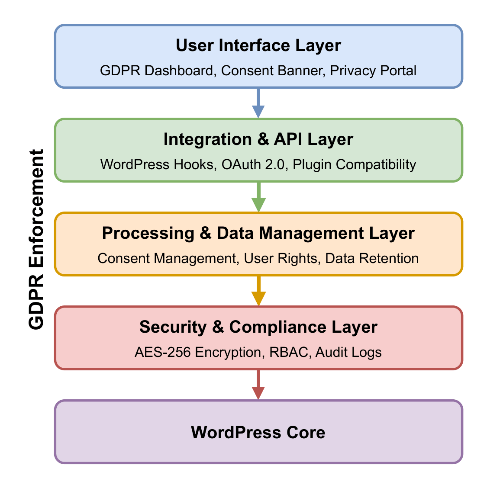
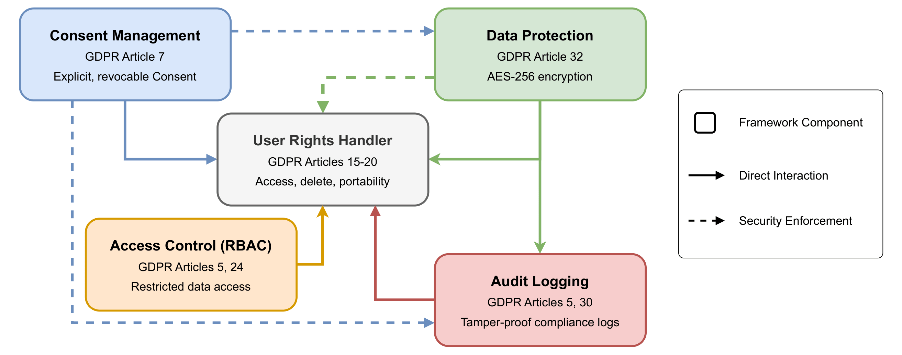

# WordPress GDPR Compliance Framework

[](https://doi.org/10.5220/0014228400004061)
[](https://www.php.net/)
[](https://wordpress.org/)
[](https://www.gnu.org/licenses/gpl-2.0)

**Abstract**: Enforcing GDPR compliance in plugin-based Content Management Systems like WordPress presents significant technical challenges due to the lack of native compliance mechanisms and the fragmentation of existing solutions. This framework presents a modular, coordination-centric GDPR compliance solution that integrates consent management, AES-256 encryption, role-based access control, and cryptographic audit logging for WordPress's distributed architecture. Our framework introduces an event-driven coordination layer enforcing consistent privacy policies across heterogeneous plugins, performance optimizations achieving sub-400ms overhead, and automated compliance validation covering consent, retention policies, and cross-border transfers. Evaluation through controlled experiments demonstrates 96% violation detection with 3% false positives, 70-90ms response time overhead at typical loads, and 98.3% reduction in manual compliance effort while maintaining 98%+ accuracy.

## Requirements

- WordPress >= 5.8
- PHP >= 7.4 (8.0+ recommended)
- MySQL >= 5.7 / MariaDB >= 10.3
- OpenSSL >= 1.1.1
- TLS >= 1.2 (1.3 recommended)

## Architecture

The framework uses a layered architecture with four primary layers:

System Architecture             |  Core Components
:-------------------------:|:-------------------------:
   |  

## Installation

To install the GDPR Compliance Framework, run the following:

```bash
cd wp-content/plugins/
git clone https://github.com/PanagiotisNikolaidis236322/Wordpress-gdpr-framework-thesis.git wp-gdpr-framework
```

Then activate the plugin via WordPress Admin → Plugins.

## Usage

After activation, configure the framework via **GDPR Framework → Settings**:

```php
// Example: Display consent form
echo do_shortcode('[gdpr_consent_form]');

// Example: Display privacy dashboard
echo do_shortcode('[gdpr_privacy_dashboard]');
```

## GDPR Coverage

| Article | Requirement | Implementation |
|---------|-------------|----------------|
| Art. 5 | Lawful processing | Policy enforcement |
| Art. 7 | Explicit consent | Consent management |
| Arts. 15-20 | User rights | Rights handler |
| Art. 25 | Privacy by design | Default protection |
| Art. 30 | Processing records | Audit logging |
| Art. 32 | Security measures | AES-256, RBAC |

## Citation

If you find this code useful, please cite the following paper:

```bibtex
@conference{icissp26,
  author={Panagiotis Nikolaidis and Costas Iordanou},
  title={A Modular GDPR Compliance Framework for Content Management Systems: Architectural Coordination and Performance Optimization in Plugin-Based Environments},
  booktitle={Proceedings of the 12th International Conference on Information Systems Security and Privacy - Volume 1: ICISSP},
  year={2026},
  pages={497-504},
  publisher={SciTePress},
  organization={INSTICC},
  doi={10.5220/0014228400004061},
  isbn={978-989-758-800-6},
  issn={2184-4356},
}
```
